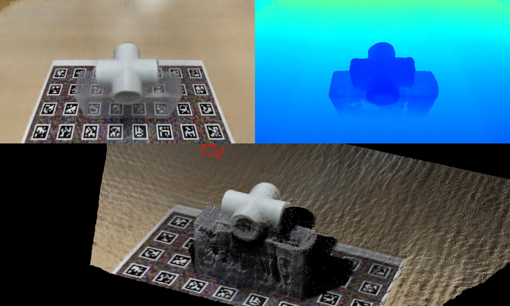

# NeRF - Neural Radiance Fields

[](https://jp.mathworks.com/matlabcentral/fileexchange/157366-nerf-neural-radiance-fields)

[](https://matlab.mathworks.com/open/github/v1?repo=matlab-deep-learning/nerf&project=nerf.prj&file=src/NeRF_Tutorial.mlx)

MATLAB&reg; implementation of optimizing a neural representation for a single scene called [NeRF](https://www.matthewtancik.com/nerf) and rendering new views.



<https://github.com/tohruk/nerf/assets/93125/e8308d96-16ab-4297-ba6a-a3081389818e>

## Quick demo  

1. Open `nerf.prj` on MATLAB.
2. Run `NeRF_CameraPoseEstimationUsingAprilTag.mlx` to perform camera calibration and pose estimation.

   ```matlab
   >> edit NeRF_CameraPoseEstimationUsingAprilTag.mlx
   ```

3. Run `NeRF_Training_Example.mlx` to train neural radiance field.

   ```matlab
   >> edit edit NeRF_Training_Example.mlx
   ```

### [MathWorks&reg; Products](https://www.mathworks.com)

Requires MATLAB release R2023a or newer

- [MATLAB](https://www.mathworks.com/products/matlab.html)
- [Deep Learning Toolbox&trade;](https://www.mathworks.com/products/deep-learning.html)
- [Image Processing Toolbox&trade;](https://www.mathworks.com/products/image.html)
- [Computer Vision Toolbox&trade;](https://www.mathworks.com/products/computer-vision.html)
- [Lidar Toolbox&trade;](https://www.mathworks.com/products/lidar.html)
- [Parallel Computing Toolbox&trade;](https://www.mathworks.com/products/parallel-computing.html)
- [Simulink&reg; 3D Animation&trade;](https://www.mathworks.com/products/3d-animation.html)
- [Robotics System Toolbox&trade;](https://www.mathworks.com/products/robotics.html) (Optional)

## License

The license is available in the [License.txt](License.txt) file in this GitHub repository.

## Community Support

[MATLAB Central](https://www.mathworks.com/matlabcentral)

Copyright 2023 The MathWorks, Inc.
